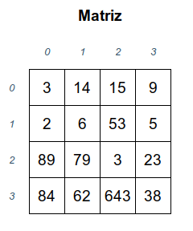

# Algoritmo-guloso

	O algoritmo tem como objetivo percorrer uma matriz quadrada de forma gulosa, lida de um arquivo que foi gerada aleatoriamente, afim de chegar na posição NxN da matriz passando pelas posições de maior valor. Antes de começar o algoritmo, o programa armazena a matriz do arquivo em uma outra matriz declarada no escopo e alocada dinamicamente para poder ler. Durante o caminho só é permitiddo caminhar para baixo, para esquerda ou direita e para as diagonais inferiores, ou seja, é proibido caminhar para alguma posição na linha a cima da posição atual. Alem disso durante o caminho o programa armazena o valor de cada posição em um vetor e no final soma todos esses valores.  

		Além disso há casos que precisaram ser tratados, como por exemplo quando a posição atual é na borda, ou seja na primeira ou na ultima linha e na primeira ou na ultima coluna. Para tais casos o algoritmo vai apenas analisar as posições disponíveis para caminhar, porém há um caso no qual precisam ser tratado a parte, que no caso seria quando a posição atual é qualquer uma na ultima linha, nesse caso o algoritmo irá caminhar até a ultima posição, andando reto, no caso para direita. Existe outros dois casos especiais, que seria quando a posiçao atual fosse uma acima da posição NxN ou seja (N-1)x(N) e quando a posição atual fosse na diagonal superior direita da posiçao NxN ou seja (N-1)x(N-1). Nesses casos o algorimto nao irá analisar as outras posições em volta, irá apenas caminhar para a posição NxN da matriz e encerrando o programa.

	fig 1

	Na fig 1 partindo da posição 0x0 o caminho feito seria : 14, 53, 79, 643 e 38 que é a ultima posição, e seria printado a soma desses valores, que no caso seria 827

	

	Importante lembrar que esse código lê 4 matrizes de uma vez, porem ele armazena apenas uma na matriz alocada. Após realizar o processo em uma matriz, ele zera a outra e recomeça tudo de novo. Dito iaso, o programa realiza a soma das posições de cada matriz individualmente, e no final faz a soma total desses valores 

# Compilação e Execução

O código possui um arquivo Makefile que realiza todo o procedimento de compilação e execução. Para tanto, temos as seguintes diretrizes de execução:

| Comando                |  Função                                                                                           |                     
| -----------------------| ------------------------------------------------------------------------------------------------- |
|  `make clean`          | Apaga a última compilação realizada contida na pasta build                                        |
|  `make`                | Executa a compilação do programa utilizando o gcc, e o resultado vai para a pasta build           |
|  `make run`            | Executa o programa da pasta build após a realização da compilação                                 |
